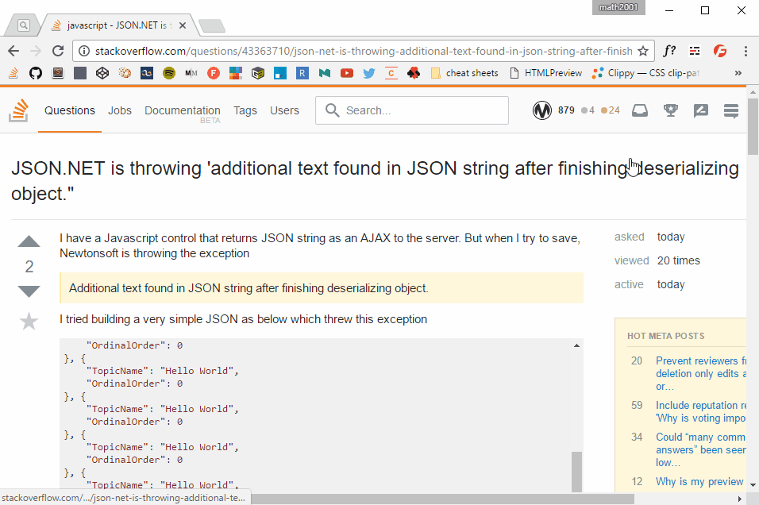

# Google Font Testr

A chrome extension to try fonts coming from [Google Font][] live.

*Note: the extension has changed a bit since this screenshot has been taken* :wink:

## Installation

It fairly easy. Just download the `google-font-testr.crx` from the [latest release][] file and drag/drop it on the [`chrome://extension`](chrome://extension) page.

That's it!

## Tips

Try to press the `shift` and `ctrl` when you click on buttons, you'll find some little tricks :wink:

[latest release]: https://github.com/math2001/google-font-testr/releases/latest

[Google Font]: https://fonts.google.com/
