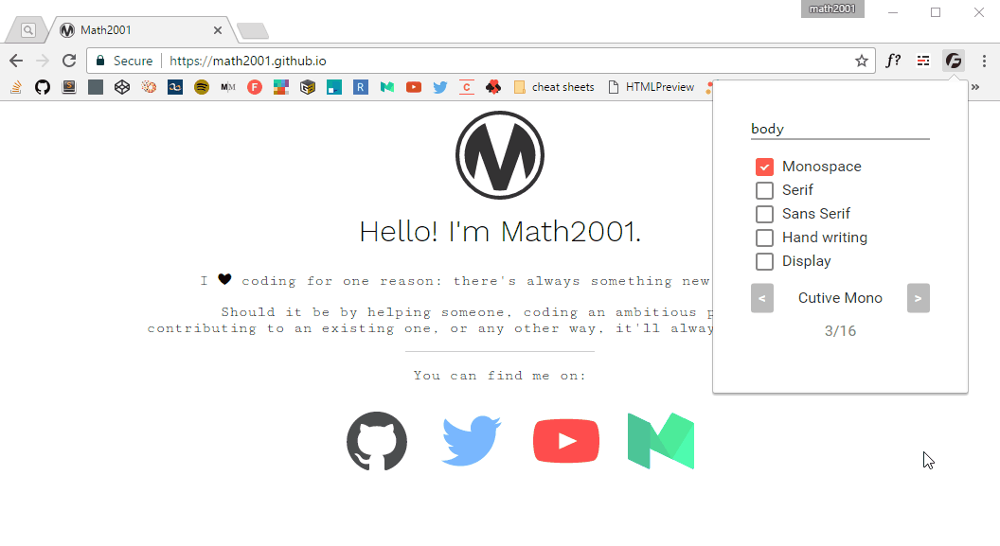

# Google Font Testr

A chrome extension to try fonts coming from [Google Font][] live.

*Note: the extension has changed a bit since this screenshot has been taken* :wink:

## Installation

It fairly easy. Just download the [`google-font-testr.crx`](google-font-testr.crx) file and drag/drop it on the [`chrome://extension`](chrome://extension) page.

That's it!

[Google Font]: https://fonts.google.com/
